# UNPUN Workshop Flow

## Flow Principle

Use the Pony Tail pass for this workflow: fewer screens, fewer decisions, one clear handoff.

- LINE OA is the public entry point.
- The customer web app is only for formula creation and confirmation.
- The public backend stores orders and notifies staff.
- The Macbook Print Station turns confirmed orders into print-ready files.
- RD works from the production sheet, not from the customer page.

## End-to-End Flow

```mermaid
flowchart LR
  A["Customer scans QR"] --> B["Add LINE OA"]
  B --> C["Tap workshop link in LINE"]
  C --> D["Customer Web App"]
  D --> E["Enter name / phone / LINE"]
  E --> F["Build formula"]
  F --> G["Review label + cost"]
  G --> H["Submit order"]

  H --> I["Public Backend"]
  I --> J["Google Sheet / Order DB"]
  I --> K["LINE OA staff alert"]

  J --> L["Macbook Print Station"]
  L --> M["Generate bottle label"]
  L --> N["Generate RD production sheet"]
  M --> O["Brother QL-800 print queue"]
  N --> P["RD prepares formula"]
  O --> Q["Apply label to bottle"]
  P --> Q
  Q --> R["Customer receives product"]
```

## Customer Flow

1. Scan QR.
2. Add LINE OA.
3. Tap the workshop link from LINE OA.
4. Fill basic contact details.
5. Choose a guide archetype or build freely.
6. Select ingredients across A-E.
7. Review formula, label preview, and estimated cost.
8. Confirm once.
9. See a success page with order status.

Customer must not see webhook URLs, sheet IDs, sync retry controls, order history, printer settings, or RD-only details.

## System Flow

1. Web app validates that the formula totals 100%.
2. Web app creates an order code and customer code.
3. Web app sends the order to the public backend.
4. Backend writes the order to Google Sheet / Order DB.
5. Backend sends a LINE OA staff alert.
6. Macbook Print Station polls or subscribes to new orders.
7. Print Station generates:
   - Brother label artwork
   - RD production sheet
   - optional CSV backup
8. Staff prints from the Macbook connected to Brother QL-800.

## RD / Staff Flow

1. Receive LINE alert or see the new order in Print Station.
2. Review the RD production sheet.
3. Prepare formula.
4. Fill bottle.
5. Print and apply label.
6. Mark order as packed / delivered in the sheet.

## Recommended Screens

- `Customer App`: QR/LINE users only, formula builder and submit.
- `Success Page`: confirms order received and tells customer to wait for staff.
- `Print Station`: Macbook-only order queue, label preview, RD sheet, print/download actions.
- `Google Sheet`: operational database and status tracking.

## Status Model

- `submitted`: customer submitted the order.
- `received`: backend saved the order.
- `ready_to_print`: Print Station generated files.
- `in_production`: RD started preparing the formula.
- `packed`: bottle filled and labeled.
- `delivered`: handed to customer.
- `sync_error`: backend or sheet write failed.
- `print_error`: label or RD sheet print failed.

## Key Decisions

- Do not rely on the customer's phone for printing.
- Do not expose back-office controls in the customer app.
- Do not make the customer choose printer or file formats.
- Keep cost visible, but keep operational cost controls private.
- Use LINE OA for entry and staff notification, not as the only database.
- Keep the Macbook as the print operator because Brother QL-800 is physically connected there.
